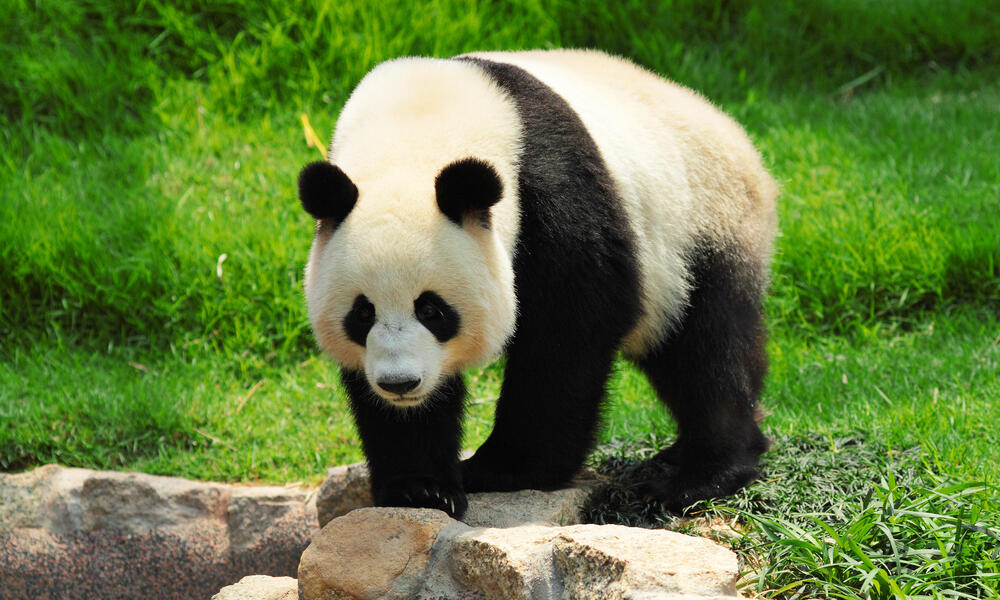
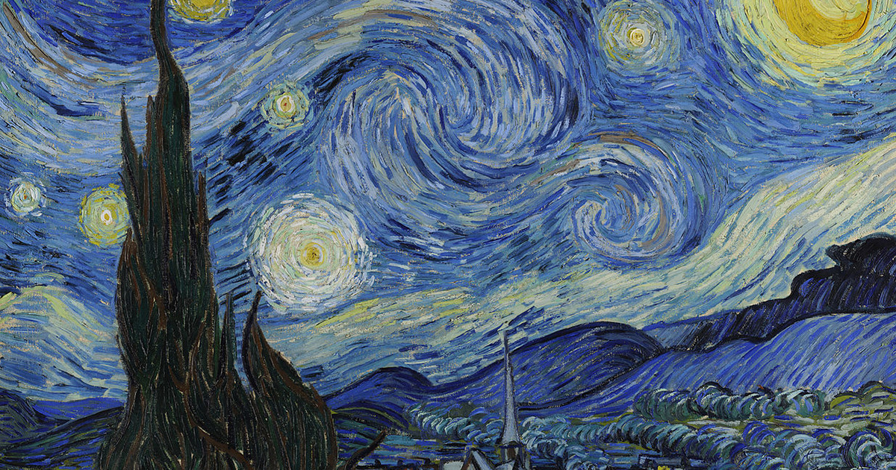
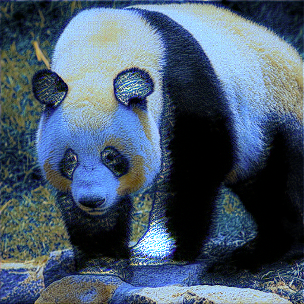

# NeuralStyleTransfer
Followed [tutorial](https://www.youtube.com/watch?v=imX4kSKDY7s&ab_channel=AladdinPersson) that uses PyTorch to use neural networks for style transferring.
   
   
  
     
     
     
   
